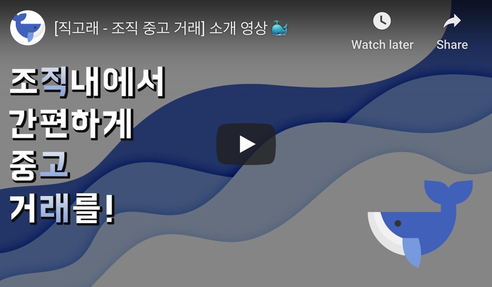
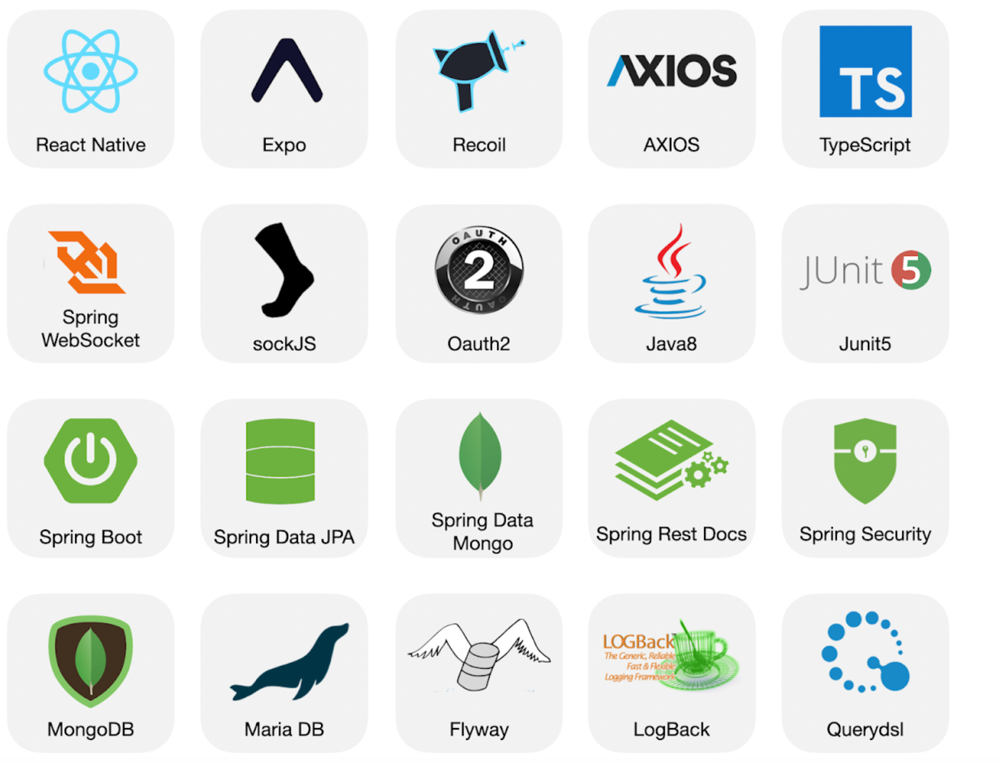
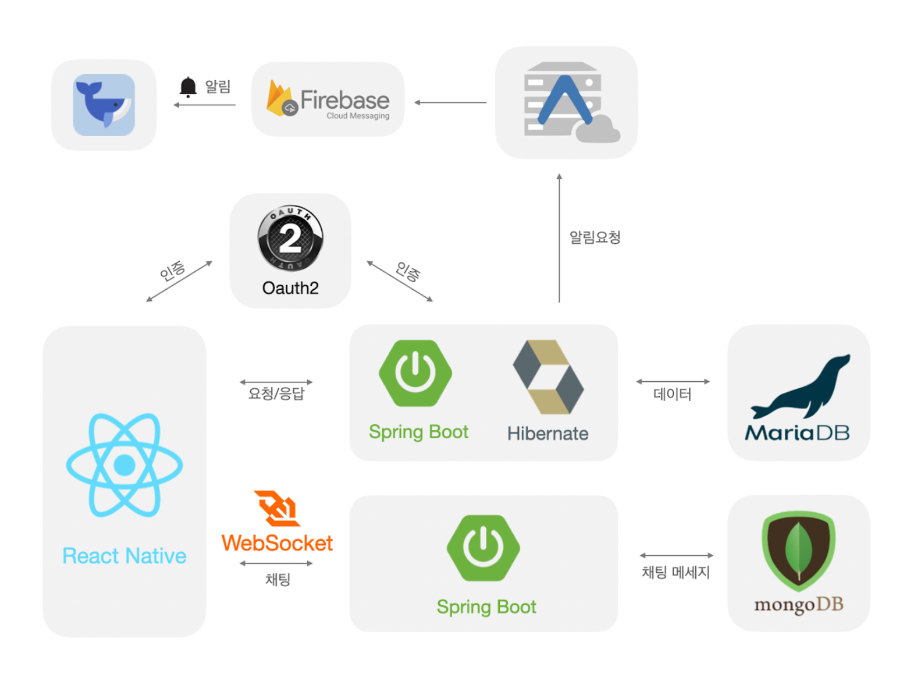
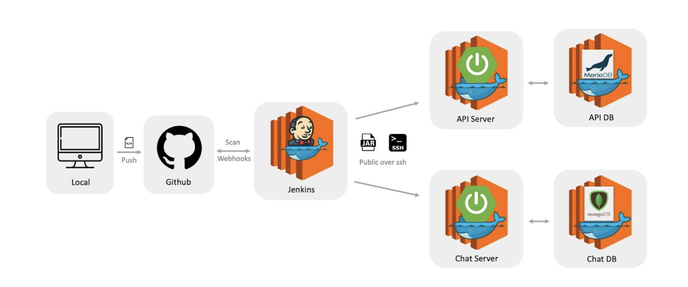

  

*대한민국 중고 거래 앱 곧 1등!*

*당신이 속한 그룹 어디든, 당신이 원하는 무엇이든 사고 팔 수 있는 조**직** 중**고** 거**래** 서비스, 직고래입니다.*

 

## 🐳 직고래 이야기

  <a target="_blank" href="https://www.youtube.com/watch?v=IZWhBI0Tk2c">
    
    
(클릭하면 영상을 실행할 수 있습니다)

  </a>

 

## 🥰 직고래는 따듯한 교류가 있는 조직 벼룩시장을 꿈꾸고 있어요.

아무리 사소한 물건이라도 직고래를 이용하면 문제없어요.

조직 내에서 가까운 사람과 거래하기 때문에 가벼운 마음으로, 가까운 거리에서, 안전하게 거래를 할 수 있답니다.

조직 간의 전체 채팅을 통해 다양한 이야기를 주고받을 수도 있어요.

**더 끈끈한 조직 문화를 만들어내는 지름길, 직고래를 이용해보세요.**

 

## 🛠 기술 스택

 

## 🏗 프로젝트 아키텍처

 

## 📲 CI/CD

 

## 🏠 팀소개

||||||
|:---:|:---:|:---:|:---:|:---:|
|[Github](https://github.com/joseph415)|[Github](https://github.com/jnsorn)|[Github](https://github.com/lxxjn0)|[Github](https://github.com/kouz95)|[Github](https://github.com/begaonnuri)|
